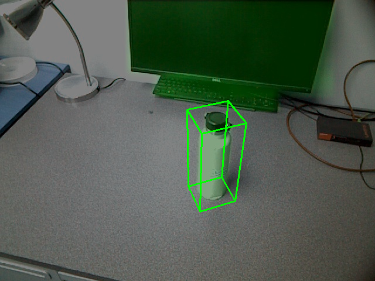

# Our Category-Level Pose Estimation for ROS
Pytorch implementation of our category-level pose estimation for ROS.

## Installation - From Pip
```shell
cd Pose_Estimator_ROS
pip install -r requirements.txt
```

## Start Running 
```shell
cd Pose_Estimator_ROS
sh script.sh
```

## Script Parameters
<details>
  <summary>[Click to expand]</summary>

- **script.sh**
  - **pretrained_clip_rot_model_path**: Pretrained Contrast Rotation Model
  - **pretrained_clip_t_model_path**: Pretrained Contrast Translation Model
  - **resume_model**: Pretrained Estimator Model
  - **depth_pth**: The Saved Path of Depth image from ROS
  - **detection_pth**: The Saved Path of MaskRCNN Mask Results from ROS
  - **label_pth**: The Saved Path of MaskRCNN Class Label Results from ROS
  - **bbox_pth**: The Saved Path of Bounding box from ROS
  - **ROS_RGB_pth**: The Saved Path of RGB Image from ROS
  - **ROS_output**: The Output Folder Path
  - **ROS_save_result_name**: The Output File Name
</details>

